# ReconPlus Architecture Diagram Source

This file contains a Mermaid diagram that matches the current codebase structure and runtime flow.

## Legend

- Solid arrow: primary data flow
- Dashed arrow: optional or external dependency
- Output nodes: generated artifacts in `output/`

## Mermaid

```mermaid
flowchart LR
  %% =========================
  %% LAYER 1: UI
  %% =========================
  subgraph L1[1. User Interface Layer - React + Firebase Frontend]
    U[User / Security Analyst]
    DASH["User Dashboard\n(overview, tools, history)"]
    FORM["Target Input Form\n(domain submission)"]
    ASSISTW[Floating AI Assistant Widget]
    FIRE["Firebase Auth + Firestore\n(user accounts + scan history)"]
  end

  %% =========================
  %% LAYER 2: API + ORCHESTRATION
  %% =========================
  subgraph L2[2. Backend API and Orchestration Layer - Flask]
    API["Flask API - app.py\n/api/scan\n/api/scan/status\n/api/report/json\n/api/report/pdf\n/api/assistant/chat\n/api/assistant/status"]
    STAT["Scan Status Manager\n(in-memory state + progress)"]
    WORKER[Background Scan Worker Thread]
    MAIN[Pipeline Orchestrator - main.py]
  end

  %% =========================
  %% LAYER 3: RECON + VULN ENGINE
  %% =========================
  subgraph L3[3. Recon and Vulnerability Engine Layer]
    SYSINFO["System Information\n(core/system_info.py)"]
    NETINFO["Network Enumeration\n(core/network_info.py)"]
    METADATA["Scan Metadata Generation\n(core/scan_tracker.py)"]
    NORM[Target Normalization]
    SUB["Subdomain Enumeration\n(Subfinder only)"]
    LIVE["Live Host Detection\n(HTTPX)"]
    WEB["Web Vulnerability Scanning\n(Nuclei)"]
    REMEDY["Attach Remediation Guidance\n(core/remediation/remedy_engine.py)"]
    SVC["Local Service Enumeration\n(core/service_enum.py + ss)"]
    CLEAN["Service Deduplication\n(core/data_cleaner.py)"]
    CVE["CVE Enrichment\n(core/cve_enricher.py + core/cve_fetcher.py)"]
    EXP["Exposure Classification\n(core/exposure_classifier.py)"]
    DOCK["Docker Port Binding Inspection\n(core/docker_inspector.py)"]
    ADJ["Risk Adjustment\n(core/risk_adjuster.py)"]
    PR["Privilege Escalation Analysis\n(core/privesc/privesc_engine.py)"]
    PRCHECKS["Sudo, SUID, Writable Paths, Docker Group,\nCron, Env Hijack, Kernel Surface"]
    CHAIN["Attack Chain Builder\n(core/attack_chain/chain_builder.py)"]
    MITRE["MITRE ATT&CK Mapping\n(core/mitre/attack_mapper.py)"]
    ESC["Chain-Based Risk Escalation\n(core/risk/chain_escalator.py)"]
  end

  %% =========================
  %% LAYER 4: RISK + REPORTING
  %% =========================
  subgraph L4[4. Risk Intelligence and Reporting Layer]
    SCORE["Risk Scoring Engine\n(core/scoring/cvss_engine.py)"]
    ANA["Risk Summary\n(core/risk_analyzer.py)"]
    REC["Automated Remediation\n(core/remediation/recommendations.py)"]
    SUM["Executive Summary\n(core/executive/summary.py)"]
    HTML["HTML Report Generator\n(core/reporting/html_report.py)"]
    PDF["PDF Report Generator\n(core/reporting/pdf_report.py)"]
  end

  %% =========================
  %% LAYER 5: STORAGE + EXTERNAL SERVICES
  %% =========================
  subgraph L5[5. Storage and External Services]
    OUT[(output/recon.json)]
    OUTHTML[(output/report.html)]
    OUTPDF[(output/report.pdf)]
    MODEL["Assistant Model Storage\n(local dir or ZIP via env vars)"]
    NVD[("NVD API\nCVE data")]
    WSL["Linux / WSL Tool Runtime\nss, ip, sudo, docker, nuclei, httpx, subfinder"]
  end

  %% =========================
  %% FRONTEND FLOW
  %% =========================
  U --> DASH
  DASH --> FORM
  DASH --> ASSISTW
  DASH -->|scan history| FIRE
  FORM -->|POST /api/scan| API
  DASH -->|GET /api/scan/status| API
  DASH -->|GET /api/report/json| API
  DASH -->|GET /api/report/pdf| API
  ASSISTW -->|POST /api/assistant/chat| API

  %% =========================
  %% API FLOW
  %% =========================
  API --> STAT
  API --> WORKER
  WORKER --> MAIN
  API -->|GET /api/assistant/status| ASSIST_ENGINE

  %% =========================
  %% PIPELINE FLOW
  %% =========================
  MAIN --> SYSINFO
  MAIN --> NETINFO
  MAIN --> METADATA
  MAIN --> NORM
  NORM --> SUB --> LIVE --> WEB --> REMEDY
  MAIN --> SVC --> CLEAN --> CVE --> EXP --> ADJ
  EXP --> DOCK
  ADJ --> PR --> PRCHECKS --> CHAIN --> MITRE --> ESC

  MAIN --> SCORE
  MAIN --> ANA
  MAIN --> REC
  MAIN --> SUM
  MAIN --> HTML
  MAIN --> PDF

  REMEDY --> REC
  PR --> REC
  CHAIN --> REC

  %% =========================
  %% OUTPUTS
  %% =========================
  SYSINFO --> OUT
  NETINFO --> OUT
  METADATA --> OUT
  MAIN --> OUT
  REMEDY --> OUT
  HTML --> OUTHTML
  PDF --> OUTPDF
  OUT --> API
  OUTHTML --> API
  OUTPDF --> API
  OUT --> ASSIST_ENGINE

  %% =========================
  %% ASSISTANT
  %% =========================
  subgraph ASSIST_LAYER[AI Assistant Layer - Hybrid]
    ASSIST_ENGINE["core/assistant/assistant_engine.py\nRule-based router + optional model generation"]
  end
  ASSIST_ENGINE --> MODEL
  ASSIST_ENGINE --> OUT

  %% =========================
  %% EXTERNAL DEPENDENCIES
  %% =========================
  CVE -.-> NVD
  MODEL -.-> ASSIST_ENGINE
  WSL -.-> SUB
  WSL -.-> LIVE
  WSL -.-> WEB
  WSL -.-> SVC
  WSL -.-> PR
  FIRE -.-> DASH
```

## IEEE Paper Compliance Notes

**Accuracy Statement:**
This diagram represents the **actual implemented architecture** as of the current codebase. All components shown are actively used in the pipeline.

**Key Implementation Details:**
- System information, network enumeration, and scan metadata are collected upfront (core/system_info.py, core/network_info.py, core/scan_tracker.py)
- Web scanning uses Subfinder (not Amass), HTTPX, and Nuclei with integrated remediation guidance
- Directory discovery and technology fingerprinting (Feroxbuster, Wappalyzer) are available as modules but not integrated into the main pipeline
- Local service enumeration uses `ss` command, not Nmap
- All multi-module flows (web, privesc, attack chains) feed into the remediation and reporting layers
- The assistant engine provides hybrid responses: rule-based fast path for common queries, optional LLM generation for complex insights

**Design Guidelines:**
- Keep the recon engine as a sequential pipeline, not a single opaque box
- The assistant reads latest report context from `output/recon.json`, not NVD API
- Firestore is for frontend user/account and scan history only
- Main outputs: `output/recon.json`, `output/report.html`, `output/report.pdf`
- Prefer 16:9 canvas with layered, executive-style cybersecurity theme