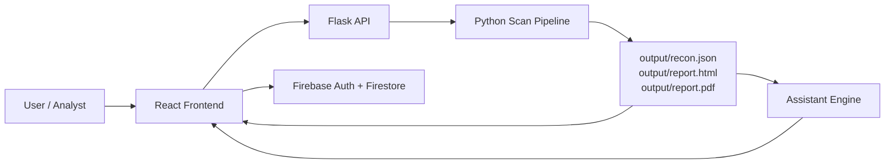

# ReconPlus Interview Guide

This document is meant to help explain the entire ReconPlus project in an interview, both conceptually and technically. It covers what the project does, why it was built, how the frontend and backend connect, how the assistant works, how the scan pipeline is organized, what each important file does, what libraries are used, and what questions an interviewer may ask.

If you read only one document before your interview, read this one.

---

## 1. One-Line Pitch

ReconPlus is an automated security reconnaissance and risk assessment platform that takes a target domain, runs discovery, vulnerability scanning, local exposure analysis, privilege-escalation checks, attack-chain reasoning, and report generation, then presents the results in a React dashboard and an AI-assisted chat experience.

---

## 2. Why This Project Was Built

The core idea is to reduce the manual effort involved in an early-stage security assessment.

In a real assessment, an analyst usually has to:

1. Discover the attack surface.
2. Find live hosts and services.
3. Check for known vulnerabilities.
4. Inspect local service exposure.
5. Analyze privilege-escalation conditions.
6. Decide what matters most.
7. Prepare a report that both technical and non-technical people can understand.

ReconPlus combines those steps into a single pipeline so that a security analyst can go from a domain to a prioritized report without manually switching between many separate tools.

The project is useful because it:

- Saves time during reconnaissance and triage.
- Standardizes how findings are collected and scored.
- Converts raw scanner output into prioritized intelligence.
- Gives both technical output and executive-level summary output.
- Adds a context-aware assistant that can answer questions about the latest scan.

---

## 3. What Problem It Solves

Most security tools are specialized.

- One tool finds subdomains.
- Another finds live hosts.
- Another checks for vulnerabilities.
- Another checks local misconfigurations.
- Another generates a report.

The problem is not just finding data. The problem is connecting all of it into one meaningful story.

ReconPlus solves that by doing three things:

1. **Collection** - gather signals from scanners and host inspection.
2. **Correlation** - connect findings across services, exposure, and privilege escalation.
3. **Communication** - produce dashboard, PDF, HTML, JSON, and AI assistant output.

That is the main value proposition of the project.

---

## 4. High-Level Architecture

The system has four major layers:

1. **Frontend** - React dashboard and Firebase auth/history.
2. **Backend API** - Flask app that receives requests and serves reports.
3. **Analysis Engine** - Python pipeline that performs scanning, enrichment, scoring, and reporting.
4. **Assistant Layer** - hybrid rule-based + optional model-based Q&A over the latest report.



---

## 5. End-to-End Workflow

This is the most important flow to remember for interview questions.

### Step-by-step flow

1. The user opens the React dashboard.
2. The user signs in through Firebase.
3. The dashboard reads the user role from Firestore and routes the user to the correct view.
4. The user enters a target domain in the Tools tab.
5. The frontend sends a request to Flask at `POST /api/scan`.
6. Flask starts the scan in a background thread so the request does not block.
7. `main.py` orchestrates the analysis pipeline.
8. The scan engine runs subdomain discovery, live host probing, and nuclei scanning.
9. Local host checks gather services, Docker exposure, and privilege-escalation clues.
10. The system enriches services with CVE data from NVD.
11. The system classifies exposure and adjusts risk.
12. The system builds attack chains and maps them to MITRE ATT&CK.
13. The system calculates numeric risk and compromise probability.
14. The system generates recommendations and an executive summary.
15. JSON, HTML, and PDF reports are written to the output folder.
16. The frontend fetches the JSON report and displays it in the dashboard.
17. The floating assistant reads the same JSON report and answers questions about it.

### Short explanation you can say in an interview

The frontend sends a scan request, Flask runs a background pipeline, the pipeline gathers recon and host signals, enriches them with CVE and exposure context, scores the findings, generates reports, and then the dashboard and assistant consume the final JSON output.

---

## 6. Project Structure Explained

### Root files

| File | Purpose |
|---|---|
| app.py | Flask API, report delivery, assistant endpoint, scan state management |
| main.py | Main orchestration pipeline |
| config.py | NVD API key configuration |
| requirements.txt | Python backend dependencies |
| README.md | Project overview and setup instructions |
| info.txt | Auxiliary metadata, not runtime logic |
| resume.cfg | Auxiliary metadata, not runtime logic |

### Backend directories

| Folder | Purpose |
|---|---|
| core/ | Analysis, scoring, reporting, assistant, risk logic |
| modules/ | Wrappers around external security tools |
| templates/ | Legacy Flask HTML page |
| output/ | Generated runtime artifacts |
| docs/ | Architecture documentation |

### Frontend directories

| Folder | Purpose |
|---|---|
| frontend/src/pages/ | Screen-level React pages |
| frontend/src/components/ | Reusable UI components |
| frontend/src/services/ | Frontend API client |
| frontend/src/firebase/ | Firebase initialization |
| frontend/public/ | Static assets |

---

## 7. Backend Entry Points

### app.py

This is the Flask application layer.

It handles:

- `GET /` legacy HTML page
- `GET /api/health`
- `POST /api/scan`
- `GET /api/scan/status`
- `GET /api/report/json`
- `GET /api/report/pdf`
- `POST /api/assistant/chat`
- `GET /api/assistant/status`
- legacy `POST /scan`

It also maintains in-memory scan status so the frontend can display progress while the scan is running.

### main.py

This is the scan orchestrator.

It combines the outputs of:

- web scanning
- service enumeration
- CVE enrichment
- exposure classification
- risk adjustment
- privilege-escalation analysis
- attack chain building
- MITRE mapping
- numeric scoring
- recommendations
- executive summary generation
- report generation

### config.py

This currently stores the NVD API key as a hardcoded value.

In an interview, be honest that this is functional but not ideal. A better design would load it from an environment variable.

---

## 8. Backend Pipeline in Detail

The main pipeline is in `main.py`, inside `run_recon(domain, progress_callback=None)`.

### Pipeline stages

| Stage | What it does | Main file(s) |
|---|---|---|
| Web scan | Finds subdomains, live hosts, and nuclei findings | core/scanner_engine.py, modules/* |
| Service enumeration | Lists running local services via `ss` | core/service_enum.py |
| Deduplication | Removes duplicate service entries | core/data_cleaner.py |
| CVE enrichment | Adds CVEs from NVD to services | core/cve_enricher.py, core/cve_fetcher.py |
| Exposure classification | Determines whether a service is local, container-bound, or externally exposed | core/exposure_classifier.py, core/docker_inspector.py |
| Risk adjustment | Adjusts risk based on exposure | core/risk_adjuster.py |
| Privilege escalation | Detects sudo, SUID, writable paths, docker group, env hijack, etc. | core/privesc/* |
| Attack chains | Connects exposure and privesc into possible compromise paths | core/attack_chain/chain_builder.py |
| MITRE mapping | Maps chains to ATT&CK techniques | core/mitre/attack_mapper.py |
| Scoring | Converts findings into numeric risk | core/scoring/cvss_engine.py |
| Risk summary | Produces severity counts | core/risk_analyzer.py |
| Recommendations | Generates remediation guidance | core/remediation/recommendations.py |
| Executive summary | Converts technical results into plain language | core/executive/summary.py |
| Reporting | Generates HTML and PDF output | core/reporting/* |

### Pseudo-flow diagram

```mermaid
flowchart TD
	A[run_recon(domain)] --> B[run_scan(domain)]
	B --> C[get_running_services]
	C --> D[deduplicate_services]
	D --> E[enrich_services_with_cves]
	E --> F[classify_exposure]
	F --> G[adjust_risk]
	G --> H[run_privesc_analysis]
	H --> I[build_attack_chains]
	I --> J[enrich_chains_with_mitre]
	J --> K[escalate_service_risk]
	K --> L[score_services]
	L --> M[calculate_overall_risk]
	M --> N[analyze_risk]
	N --> O[generate_recommendations]
	O --> P[generate_executive_summary]
	P --> Q[write output/recon.json]
	Q --> R[generate_html_report]
	R --> S[generate_pdf_report]
```

---

## 9. Web Scanning Pipeline

The web scanning flow lives in `core/scanner_engine.py`.

### What it does

1. Normalizes the input target.
2. Checks whether the target is reachable on ports 80 or 443.
3. Runs subfinder for subdomain enumeration.
4. Runs httpx for live host detection.
5. Runs nuclei against each live host.
6. Converts nuclei output into findings.
7. Adds remediation advice using `get_remedy()`.

### External tools used

- `subfinder` for passive subdomain discovery
- `httpx` for live host probing
- `nuclei` for template-based vulnerability scanning

### Why these tools were used

- `subfinder` is good for passive discovery and expands attack surface quickly.
- `httpx` filters dead or unreachable targets before scanning.
- `nuclei` is a practical way to detect known misconfigurations and vulnerabilities using templates.

### Important behavior

If subfinder finds nothing, the code falls back to scanning the original domain.

If httpx finds nothing, it also falls back to the original domain.

That means the scan does not fully fail just because one stage is sparse.

---

## 10. Local Service and Host Analysis

The project does not only scan a website. It also inspects the local machine or analysis environment.

### Service enumeration

`core/service_enum.py` uses `ss -tulnp` to identify listening services.

It extracts:

- protocol
- port
- service name
- risk label
- process information

The port-to-service risk mapping is stored in `core/service_intel.py`.

### Network info

`core/network_info.py` uses `ip -o -4 addr show` to collect interface and IP information.

### System info

`core/system_info.py` captures:

- OS name
- OS version
- kernel version
- architecture
- hostname
- current user

This data makes the report more complete and gives context about the environment being assessed.

---

## 11. CVE Enrichment

The CVE enrichment flow is in:

- `core/cve_fetcher.py`
- `core/cve_enricher.py`

### What it does

For each recognized service:

1. It picks a keyword to search in NVD.
2. It calls the NVD CVE API.
3. It parses CVSS base score and severity when available.
4. It stores the CVE list inside the service object.

### Why it matters

Raw service names are not enough.

For example, just knowing “MySQL is open” is less useful than knowing which CVEs are associated with MySQL and how severe they are.

### Key implementation detail

`core/cve_fetcher.py` uses the `requests` library and rate-limit-friendly handling with a short sleep.

### Interview-ready explanation

The project enriches services with CVE context so risk scoring is not only based on exposed ports, but also on known vulnerability intelligence from NVD.

---

## 12. Exposure Classification and Risk Adjustment

### Exposure classification

`core/exposure_classifier.py` decides whether a service is:

- `CONTAINER`
- `LOCAL`
- `EXTERNAL_POTENTIAL`
- `EXTERNAL_CONFIRMED`
- `UNKNOWN`

It uses Docker port bindings from `core/docker_inspector.py` and socket/process clues.

### Why this matters

A service exposed only on localhost is less risky than the same service exposed on all interfaces.

The project therefore adjusts risk based on actual exposure context rather than treating every open port equally.

### Risk adjustment

`core/risk_adjuster.py` changes the original risk according to the exposure level.

Examples:

- Critical on localhost may be downgraded.
- Critical in a container-only context may be lowered further.
- Externally exposed critical risk stays critical.

### Interview angle

This is a good answer if asked why the scoring is not just CVSS-based.

The project combines vulnerability severity with exposure context because risk is not only about the bug itself, but also about how reachable it is.

---

## 13. Privilege Escalation Analysis

The privesc logic is in `core/privesc/`.

### Main engine

`core/privesc/privesc_engine.py` calls several checks and merges their findings.

### Checks performed

| Check | File | What it looks for |
|---|---|---|
| SUID binaries | suid_scanner.py and checks/suid_binaries.py | Dangerous SUID binaries such as pkexec, vim, nmap, bash, tar, python, etc. |
| Sudo rights | sudo_analyzer.py | NOPASSWD or full sudo access |
| Writable critical paths | writable_path_checker.py | Writable `/etc/passwd`, `/etc/shadow`, `/etc/sudoers` |
| Docker group abuse | docker_group_checker.py | User is in docker group |
| Kernel surface | kernel_surface_analyzer.py | Kernel version collection |
| Writable files | checks/writable_files.py | Sensitive writable files |
| Cron jobs | checks/cron_jobs.py | Writable cron paths |
| Environment hijacking | checks/env_hijack.py | PATH hijack or dangerous env vars |

### Why this is useful

Privilege escalation checks answer the question:

If an attacker gets some foothold, can they increase privileges locally?

That is a very practical security question and a natural follow-up after web exposure and service enumeration.

### Known quirk

`run_privesc_analysis()` currently scans SUID binaries twice because it calls both `scan_suid_binaries()` and `check_suid_binaries()`. That creates duplicate SUID findings.

If asked, say this is a cleanup opportunity rather than a design requirement.

---

## 14. Attack Chains and MITRE ATT&CK Mapping

This part adds intelligence beyond raw findings.

### Attack chain builder

`core/attack_chain/chain_builder.py` combines:

- exposed services
- privesc findings

It produces a plausible compromise chain.

### Example logic

If there is an externally exposed service and a high-confidence Docker or sudo privesc condition, the chain can be escalated to `ROOT_COMPROMISE`.

### MITRE mapping

`core/mitre/attack_mapper.py` maps the chain to ATT&CK techniques such as:

- Exploit Public-Facing Application
- Command and Scripting Interpreter
- Escape to Host
- Sudo and Sudo Caching
- Privilege Account Abuse

### Why this matters

MITRE mapping helps the report speak the language of security operations and threat modeling.

Instead of saying only “service exposed” or “sudo allowed”, the system can explain how those issues fit into known attacker behavior.

---

## 15. Risk Scoring System

The numeric scoring logic is in `core/scoring/cvss_engine.py`.

### Scoring layers

1. Each service gets a base numeric score from its risk label.
2. Exposure can boost or reduce the effective risk.
3. Web vulnerability severity is converted into a web score.
4. Overall risk combines service posture and web posture.
5. Compromise probability is derived from the score.

### Why this is good

This makes the report easier to prioritize.

Instead of saying only “many issues were found”, the report says which issues matter most.

### Key helper functions

- `calculate_service_score()`
- `score_services()`
- `calculate_web_vulnerability_score()`
- `calculate_overall_risk()`
- `compromise_probability()`
- `risk_label_from_score()`

### Interview explanation

The system does not treat all findings equally. It blends severity, exposure, and web-vulnerability posture to produce an overall risk score that is easier to understand and prioritize.

---

## 16. Recommendations and Executive Summary

### Recommendations

`core/remediation/recommendations.py` turns findings into practical fix actions.

It creates recommendations for:

- risky services
- privesc findings
- web vulnerabilities

### Remedy engine

`core/remediation/remedy_engine.py` maps vulnerability names or keywords to remediation text.

This means that nuclei findings are not just displayed as names. They are paired with guidance.

### Executive summary

`core/executive/summary.py` produces plain-language executive text.

This is important because non-technical readers usually want:

- overall risk level
- compromise likelihood
- count of critical/high findings
- whether immediate action is needed

### Interview framing

The project separates technical detail from management summary so that one assessment can serve both engineers and decision-makers.

---

## 17. Report Generation

The final outputs are generated in:

- `core/reporting/html_report.py`
- `core/reporting/pdf_report.py`

### JSON report

The JSON report is the machine-readable source of truth.

It contains:

- metadata
- system info
- network info
- risk summary
- numeric score
- compromise probability
- services
- privesc findings
- attack chains
- web vulnerabilities
- recommendations
- executive summary

### HTML report

The HTML report is useful for browser viewing and sharing.

### PDF report

The PDF report is useful for formal reporting and printable deliverables.

### Why multiple formats

Different audiences need different output formats.

- JSON for integration and UI reuse
- HTML for browser consumption
- PDF for reporting and documentation

---

## 18. Assistant and LLM Integration

This is one of the strongest interview topics because it combines security and AI.

### File responsible

`core/assistant/assistant_engine.py`

### Assistant design

The assistant is hybrid, meaning it has two main modes:

1. **Rule-based mode** - answers common questions quickly and safely.
2. **Model-based mode** - uses a fine-tuned or local model when available.

### What the assistant reads

It reads the latest `output/recon.json` file, not live NVD data.

That means the assistant is grounded in the most recent scan result.

### Assistant flow

1. Frontend sends a user message to `POST /api/assistant/chat`.
2. Flask loads the latest JSON report.
3. `assistant_engine.ask(message, report_data)` is called.
4. The assistant first checks for direct topic matches.
5. If a rule-based answer fits, it returns that immediately.
6. If a model is loaded, it builds a prompt with scan context and generates a reply.
7. If model loading fails or the model is absent, it uses a fallback response.

### Fine-tuning / LoRA support

The code supports loading:

- a full local model directory
- a ZIP file containing the model
- a LoRA adapter with a base model

Environment variables used:

- `ASSISTANT_MODEL_DIR`
- `ASSISTANT_MODEL_ZIP`
- `ASSISTANT_BASE_MODEL`

### Interview-safe explanation of training

If asked about fine-tuning, say that the repository is designed to consume a fine-tuned model artifact, especially LoRA adapters, but the actual training process is external to this runtime project. The project focuses on loading, routing, and serving the model against scan context.

### Why this assistant is useful

It can answer:

- what the risk score means
- what vulnerabilities were found
- how to remediate them
- what the top findings are
- what a specific vulnerability means in the latest report

### Why the assistant is safe-ish

It is report-grounded and has deterministic fallbacks, so it is less likely to produce irrelevant answers than a generic chat bot.

---

## 19. Frontend Architecture

The frontend is a React SPA with a dashboard-oriented UX.

### Main page flow

| Page | Purpose |
|---|---|
| Landing | Marketing / overview page |
| RoleSelection | Chooses sign-in or sign-up role |
| Signup | Firebase registration |
| Signin | Firebase login |
| SignupSuccess | Confirmation screen |
| Dashboard | Routes to user or admin dashboard |
| UserDashboard | Scan console and assistant |
| AdminDashboard | Admin history and user review |

### Main components

| Component | Purpose |
|---|---|
| Navbar | Public navigation bar |
| NavbarDashboard | Dashboard navigation and profile controls |
| Hero | Landing page hero section |
| ProblemSection | Explains the security problem |
| FlowSection | Shows the workflow diagram |
| KeyFeatures | Highlights product features |
| RiskScoreCard | Dashboard risk pie chart |
| VulnerabilityRiskSummary | Severity summary cards |
| RiskSummary | Textual summary cards |
| KeyVulnerabilities | List of top findings |
| SecurityScanStatus | Scan progress and timing |
| FloatingAssistant | AI assistant chat widget |
| Toast | Temporary notifications |

### Frontend state flow

The important frontend logic is in `UserDashboard.jsx`:

- auth state is read from Firebase
- scan history is loaded from Firestore
- the current scan is started from the Tools tab
- progress is polled from Flask
- report JSON is fetched after completion
- scan records are stored in Firestore
- the assistant widget is rendered on the page

### Why React was used

React makes it easy to split the UI into reusable sections and update the dashboard state as scan progress changes.

---

## 20. Frontend-Backend Integration Details

### API client

`frontend/src/services/reconApi.js` is the bridge between the React app and the Flask backend.

It handles:

- starting scans
- fetching scan status
- fetching the JSON report
- sending assistant questions
- fetching assistant status
- constructing the PDF report URL

### Backend endpoints used

| Endpoint | Method | Purpose |
|---|---|---|
| /api/health | GET | Health check |
| /api/scan | POST | Start a scan |
| /api/scan/status | GET | Read scan state and progress |
| /api/report/json | GET | Get latest report data |
| /api/report/pdf | GET | Download PDF report |
| /api/assistant/chat | POST | Ask the assistant |
| /api/assistant/status | GET | Assistant readiness |

### Important note about auth tokens

The frontend attaches Firebase bearer tokens when available, but the Flask backend currently does not validate them. If asked, say this is a current security gap and a likely future improvement.

---

## 21. Firebase Usage

Firebase is used for two things:

1. Authentication.
2. Scan history persistence.

### What is stored in Firestore

The app stores:

- user profile data in `users`
- scan history in `scans`

### Why Firebase was used

Firebase gives a fast way to implement:

- login and signup
- role-based routing
- persistent history for each user
- admin review of user scans

### User vs admin behavior

- Normal users get the user dashboard.
- Admins get the admin dashboard.
- Admin signup is intentionally disabled.

---

## 22. Tech Stack and Why Each Was Chosen

### Backend

| Technology | Why it was used |
|---|---|
| Python | Natural fit for security tooling and orchestration |
| Flask | Lightweight API server |
| flask-cors | Allows frontend-backend communication |
| requests | Easy HTTP requests to NVD API |
| reportlab | PDF report generation |
| transformers | Load optional LLMs locally |
| peft | Load LoRA adapters |
| torch | LLM runtime |
| psutil | Available for system inspection if needed |

### Frontend

| Technology | Why it was used |
|---|---|
| React | SPA dashboard architecture |
| react-router-dom | Route-based page navigation |
| Firebase | Auth and Firestore persistence |
| Recharts | Risk chart visualization |
| Tailwind CSS | Fast, consistent styling |

### External tools

| Tool | Why it was used |
|---|---|
| subfinder | Subdomain discovery |
| httpx | Live host probing |
| nuclei | Vulnerability scanning |
| ss | Local service enumeration |
| ip | Network interface enumeration |
| sudo | Privilege-related checks |
| docker | Container exposure analysis |
| find | SUID discovery |

---

## 23. What is Custom Code vs What is External

### Custom code written for this project

- pipeline orchestration
- scan status handling
- exposure classification
- risk adjustment
- risk scoring
- privesc engine
- attack chain builder
- MITRE mapping
- recommendation generation
- executive summary generation
- report generation
- assistant routing and fallback logic
- React dashboard UI

### External libraries and services

- Flask
- React
- Firebase
- ReportLab
- Recharts
- Transformers
- PEFT
- Torch
- NVD API
- ProjectDiscovery tools like subfinder, httpx, nuclei

---

## 24. Important Functions to Mention in an Interview

If they ask about specific functions, these are the ones to know.

### Backend orchestration

- `run_recon()` in `main.py`
- `_run_scan_in_background()` in `app.py`
- `api_scan()` in `app.py`
- `api_scan_status()` in `app.py`

### Scanning and enrichment

- `run_scan()` in `core/scanner_engine.py`
- `run_subfinder()` in `modules/osint/subfinder_scan.py`
- `check_live_hosts()` in `modules/discovery/httpx_scan.py`
- `run_nuclei()` in `modules/vulnerability/nuclei_scan.py`
- `get_running_services()` in `core/service_enum.py`
- `enrich_services_with_cves()` in `core/cve_enricher.py`

### Risk and attack logic

- `classify_exposure()` in `core/exposure_classifier.py`
- `adjust_risk()` in `core/risk_adjuster.py`
- `run_privesc_analysis()` in `core/privesc/privesc_engine.py`
- `build_attack_chains()` in `core/attack_chain/chain_builder.py`
- `enrich_chains_with_mitre()` in `core/mitre/attack_mapper.py`
- `calculate_overall_risk()` in `core/scoring/cvss_engine.py`

### Reporting and assistant

- `generate_recommendations()` in `core/remediation/recommendations.py`
- `generate_executive_summary()` in `core/executive/summary.py`
- `generate_html_report()` in `core/reporting/html_report.py`
- `generate_pdf_report()` in `core/reporting/pdf_report.py`
- `ask()` in `core/assistant/assistant_engine.py`
- `status()` in `core/assistant/assistant_engine.py`

---

## 25. Important Class and Component Responsibilities

### Frontend components

- `Dashboard.jsx` decides whether the current user sees the user dashboard or admin dashboard.
- `UserDashboard.jsx` is the main control center for scanning, viewing risk, and using the assistant.
- `AdminDashboard.jsx` provides scan and user oversight.
- `FloatingAssistant.jsx` is the contextual Q&A widget.

### Backend classes

- `AssistantEngine` encapsulates assistant initialization, model loading, fallback handling, and response generation.

---

## 26. Data Produced by the System

The main generated artifact is `output/recon.json`.

It contains fields like:

- `metadata`
- `system`
- `network`
- `risk_summary`
- `overall_numeric_score`
- `compromise_probability_percent`
- `services`
- `privesc_findings`
- `attack_chains`
- `web_vulnerabilities`
- `recommendations`
- `executive_summary`

This file is important because both the frontend and assistant depend on it.

### Why this matters

It acts as the shared state between analysis, UI, and assistant.

---

## 27. Known Limitations and Quirks

Being honest about limitations makes you sound stronger in an interview.

### Current limitations

- Scan state is stored in memory, so it resets when Flask restarts.
- Only one scan is intended to run at a time.
- The backend does not currently validate Firebase tokens.
- `main.py` is not a general-purpose CLI entrypoint as written.
- Some wrapper modules exist but are not wired into the main pipeline.
- SUID scanning is duplicated in privesc analysis.
- Linux/WSL tooling is required for some checks like `ss` and `ip`.

### Why this is not necessarily bad

These are realistic tradeoffs for a first version or research-driven implementation.

The system is functional and modular, but it still has room for hardening and cleanup.

---

## 28. How to Explain the Project in Simple Words

If an interviewer is non-technical or asks for a plain-English summary, say:

ReconPlus is a security platform that scans a target, finds exposed services and web vulnerabilities, checks for local privilege-escalation weaknesses, scores the findings, and generates reports. It also has a dashboard and an AI assistant that can answer questions based on the latest scan.

---

## 29. How to Explain the Project in Technical Words

If they want the more technical version, say:

The system is a Flask-backed pipeline orchestration platform with a React/Firebase frontend. It integrates external scanning utilities like subfinder, httpx, and nuclei with local host inspection, CVE enrichment, Docker exposure analysis, privesc checks, ATT&CK mapping, scoring, and report generation. The output is persisted as JSON, HTML, and PDF, and an assistant layer uses that JSON context to answer scan-aware questions.

---

## 30. Likely Interview Questions and Answers

### Why did you build this project?
To reduce manual effort in reconnaissance and convert raw scan output into prioritized, report-ready intelligence.

### Why did you choose Flask?
Because it is lightweight, easy to integrate with Python security tooling, and sufficient for a threaded API-based workflow.

### Why did you choose React?
Because the dashboard needs reusable components, route-based navigation, and real-time state updates from scan progress.

### Why use Firebase?
For quick auth, role handling, and persistence of scan history without building a full custom user backend.

### How does the scan pipeline work?
The pipeline starts with web discovery, then local service enumeration, CVE enrichment, exposure classification, privesc analysis, attack-chain generation, risk scoring, recommendations, and report generation.

### Why do you use external CLI tools instead of pure Python?
Because those tools are mature, battle-tested, and save development time while providing reliable recon and vulnerability capabilities.

### What makes your scoring system better than a flat scanner output?
It combines vulnerability severity with exposure, local context, and attack-chain reasoning so the result is more actionable.

### How does the assistant know what to say?
It reads the latest scan report, uses rule-based responses for common questions, and optionally uses a local fine-tuned model for more complex responses.

### Did you fine-tune the model yourself?
The code is designed to load a fine-tuned model or LoRA adapter, but the runtime project mainly consumes the artifact rather than training it.

### What would you improve next?
I would add backend auth verification, persistent scan state, better queueing, remove duplicate checks, and wire more unused wrappers into the pipeline.

---

## 31. Good Interview Closing Statement

ReconPlus is a full-stack security assessment pipeline that turns raw recon into ranked security intelligence. The frontend provides a dashboard and assistant, the backend orchestrates scanning and reporting, and the assistant adds a report-grounded natural-language layer. The overall goal is not just to find issues, but to explain them clearly and help prioritize remediation.

---

## 32. Short Memory Hooks

Use these as quick anchors before your interview:

- Frontend = React + Firebase + dashboard + assistant.
- Backend = Flask API + orchestration.
- Core pipeline = web scan + service scan + CVE + privesc + chains + scoring + reports.
- Assistant = latest report + rule-based fallback + optional local model.
- Output = JSON, HTML, PDF.
- Value = turn raw signals into prioritized security intelligence.

